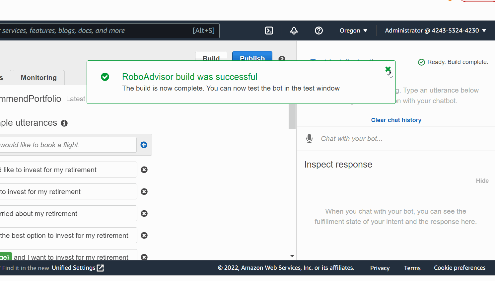

# Lex-Bot-with-Lamda-Function
As a digital transformation consultant by one of the most prominent retirement plan providers in the country, I have been asked to help increase their client portfolio—especially by engaging young people. Because machine learning and NLP are disrupting finance to improve the customer experience, I have decide to create a robo advisor. Both existing and potentially new customers will be able to use this robo advisor to get investment portfolio recommendations for retirement.
I have created a bot that will recommend an investment portfolio for a retirement via AWS Lex and Lambda.

## Technologies

AWS Lex and Lambda

### Tools:

Libraries and dependencies:

#### Imports

from datetime import datetime

from dateutil.relativedelta import relativedelta

## Results
RoboAdvisor Chat Bot

Successful Test Age Error

Successful Test Negative Age Error

Successful Test Incorrect Amount Error

Successful Test Correct Dialog

## Contributors

#### Contact
zehra.vahidy@gmail.com
LinkedIn https://www.linkedin.com/in/zehra-vahidy-6025b820

---

## License

Unlicesened

## Appendix
https://docs.github.com/en/get-started/writing-on-github/getting-started-with-writing-and-formatting-on-github/basic-writing-and-formatting-syntax#headings
https://jupyterlab.readthedocs.io/en/stable/

